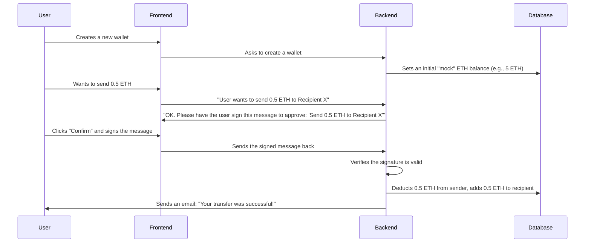

# **Build a Mock Web3 Wallet**

**Timing:** October 4, 2025, 9AM to 2PM. Last commit before 2PM IST.

**Owner:** CypherD Wallet

Submission link: https://forms.gle/EcJRTdqwJ7XSQXhD7

## 🎯 Introduction

You'll create a simple, yet functional, mock web3 wallet application. Here’s a breakdown of the two main components:

## 📋 What You'll Build

### **The Frontend (What the User Sees)**

This is the user interface of your wallet. It can be a web app, a command-line tool, or even a simple mobile app. It needs to let users:

- **Create or Import a Wallet:** Generate a new, unique 12-word secret phrase or import an existing one.
- **View Their Balance:** Display how much "mock" ETH they have.
- **Send "Mock" ETH:** Enter a recipient's address and an amount to send.
- **Approve Transactions:** Securely "sign" a message to confirm they want to send funds.
- **See Past Transactions:** View a history of their activity.

### **The Backend (The Engine Room)**

This is the server that powers your wallet. It will:

- **Manage Wallet Data:** Keep track of user balances in a database.
- **Handle Price Conversions:** Fetch real-time ETH-to-USD prices when a user wants to send a specific dollar amount.
- **Securely Verify Transactions:** Check that transaction requests are legitimate by verifying the user's digital signature.
- **Process Transfers:** Update balances in the database after a successful transfer.
- **Send Notifications:** Alert users about their transactions through a real-world channel like email or Telegram.

### **How It All Fits Together**

Here’s a simplified look at the process from start to finish:



## 🛠 **Step-by-Step Guide**

### **1. Create a Wallet & Show the Balance**

Your first step is to let users create an account and see their funds.

- **What to do:**
    - Give the user two options: generate a *new* 12-word mnemonic phrase or import an *existing* one.
    - From this phrase, you'll derive a unique Ethereum wallet address. Make sure this wallet is "remembered" so the user doesn't have to re-import it every time.
    - When a new wallet is created, add an entry for it in your database with a random starting balance of "mock" ETH (e.g., something between 1.0 and 10.0 ETH).
    - Finally, display the user's balance clearly in the UI, like "**Balance: 5.34 ETH**".

### **2. Send a Transfer**

Now for the core feature: sending ETH. This involves getting the user's approval (a signature) and having the backend verify it.

- **What to do:**
    - Create a simple form where the user can enter a recipient's address and an amount.
    - Allow the user to enter the amount in either **ETH** (e.g., 0.5) or **USD** (e.g., 1000).
    - **If the user enters ETH:**
        1. **Frontend:** Send the transfer details (sender, recipient, amount) to the backend.
        2. **Backend:** Create a simple approval message, like `"Transfer 0.5 ETH to 0x... from 0x..."`. This message should only be valid for a short time (e.g., 30 seconds). Send this message back to the frontend.
    - **If the user enters USD:**
        1. **Backend:** Before creating the approval message, you first need to figure out how much ETH is equivalent to the USD amount. To do this, you'll use a free API called **Skip API** to get a real-time price quote.
            - **Backend action (Quoting):** Query the Skip API to get the ETH equivalent for the USD amount.
                - API Endpoint: `https://api.skip.build/v2/fungible/msgs_direct`
                - Method: `POST`
                - Body:
                
                ```json
                {
                  "source_asset_denom": "0xA0b86991c6218b36c1d19D4a2e9Eb0cE3606eB48",
                  "source_asset_chain_id": "1",
                  "dest_asset_denom": "ethereum-native",
                  "dest_asset_chain_id": "1",
                  "amount_in": inputUsdAmount,
                  "chain_ids_to_addresses": {
                    "1": "0x742d35Cc6634C0532925a3b8D4C9db96c728b0B4"
                  },
                  "slippage_tolerance_percent": "1",
                  "smart_swap_options": {
                    "evm_swaps": true
                  },
                  "allow_unsafe": false
                }
                
                ```
                
        2. Once you have the ETH amount from the API, create the approval message, like `"Transfer 0.48 ETH ($1000.00 USD) to 0x... from 0x..."`, and send it to the frontend.
    - **Getting Approval (Signing):**
        1. **Frontend:** Show the approval message to the user. When they click "Confirm," use their wallet's secret key to "sign" the message. This creates a unique, verifiable digital signature.
        2. **Frontend:** Send this signature back to the backend.
    - **Final Verification and Execution:**
        1. **Backend:** Verify that the signature is correct and was generated by the sender.
        2. **(For USD transfers only):** As a security check, quickly fetch a *new* price quote from the Skip API. If the new price is very different from the original one (e.g., more than a 1% change), reject the transaction to protect the user from price swings.
        3. If everything looks good, update the balances in your database: subtract the amount from the sender and add it to the recipient.
        4. Make sure to handle errors gracefully, like if the user doesn't have enough funds or the signature is invalid.
    
    > Important: ETH and USDC use different decimal precisions. ETH values have 18 decimal places (meaning 1.0 ETH is represented as 1000000000000000000), while USDC has only 6 decimal places (1.0 USDC is 1000000). You'll need to convert between these formats when processing values to and from the API to ensure accurate calculations.
    > 

### **3. Show Transaction History**

Users should be able to see their past activity.

- **What to do:**
    - Whenever a transfer happens, save a record of it in your database (e.g., sender, recipient, amount, timestamp).
    - Create a new page or section in your frontend that fetches and displays this history, so the user has a record of their transactions.

### **4. Send Real-World Notifications**

To make the experience feel real, let's add notifications.

- **What to do:**
    - After an operation is successfully processed in the backend, trigger a notification to the user.
    - You can use a free service to send an **email**, a **Telegram message**, or another type of alert. This is a great way to show how Web3 can connect with Web2 services.

---

## ⚡ **Guidelines & Tips**

- **Your Tech Stack:** Feel free to use any programming language (JavaScript, Python, Go, etc.) and any database (SQL or NoSQL) you're comfortable with.
- **Security First:** The most important security step here is verifying the digital signature on the backend. Think about where you would securely store the user's secret mnemonic phrase (hint: for this project, keeping it in the browser's local storage or somewhere locally is fine, but in a real-world app, you'd want something more secure!).

---

## 📂 **What to Submit**

Please submit a link to a **public GitHub repository** containing:

1. **All Frontend Code:** The files for your user interface.
2. **All Backend Code:** The files for your server and API.
3. **A Great `README.md` file:** This is very important! It should include:
    - Simple instructions on how to set up and run your project.
    - A good walkthrough of how to use the app, maybe with a few screenshots or a GIF.

---

## 🎯 **Bonus Challenges**

If you have extra time, consider adding one of these:

- Generate an object for signing rather than a plain string during the transfer operation.
- Send ETH balance from your 0th index HD wallet to your 7th index HD wallet.
- **Deploy your application** to a cloud service like Vercel or AWS so anyone can try it.

---

## ❓ **FAQ**

- **"I have zero Web3 experience. Is that a problem?"**
    - Not at all! This project is designed for you. The goal is to learn by building. Focus on applying your existing Web2 skills to these new concepts.
- **"Can I use frameworks like React or Express?"**
    - Yes, absolutely! Use the tools you know and love to build faster and better.
- **"Why do we need a 'tolerance check' for USD transfers?"**
    - Crypto prices can change very quickly. The tolerance check is a safety measure to prevent a situation where the price of ETH changes significantly between when the user *approves* the transaction and when the backend *processes* it.
- **"Do the notifications have to be real?"**
    - Yes, please! Use a free and simple service to send a real notification. It's a key part of the project and shows you can integrate with third-party APIs.

**Good luck, and have fun building!**